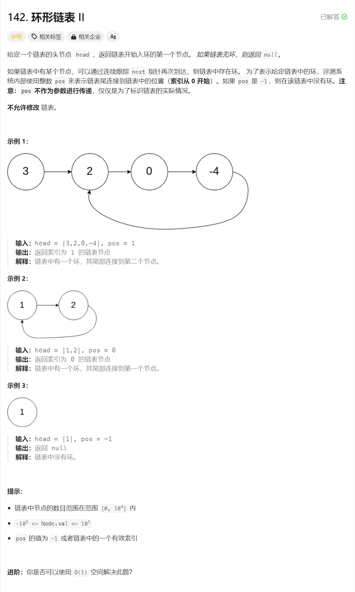
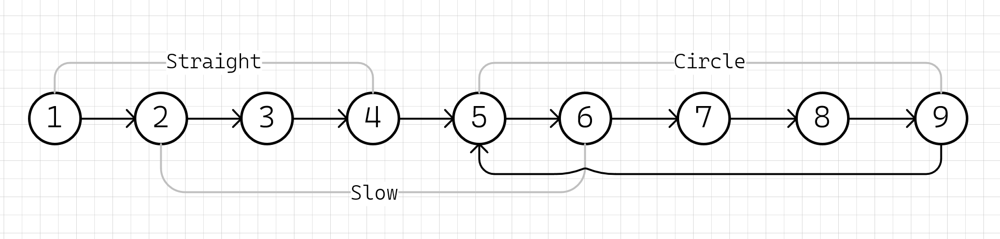
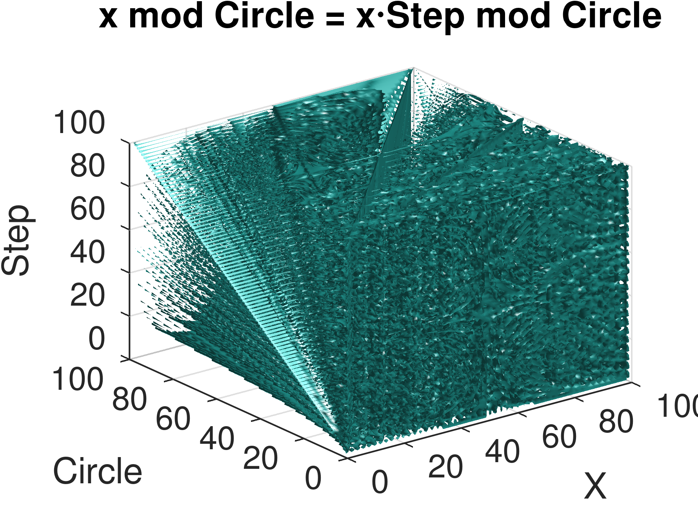

# 142. 环形链表 II


## 题解一：哈希表
用哈希表记录每个已遍历的节点，一旦遇到之前记录过节点，即找到环的入口
```cpp
ListNode* detectCycle(ListNode* head) {
    unordered_set<ListNode*> visit;
    while (head) {
        if (visit.count(head)) {
            return head;
        }
        visit.insert(head);
        head = head->next;
    }
    return nullptr;
}
```

## 题解二：快慢指针

* 假设表头到入口直线距离为$ straight_{[1..4]} $个节点（不包含入口），环长为$circle_{[5..9]}$，总长为$straight + circle $
* 慢指针$slow$每次走一步，快指针$fast$每次走两步

### 快慢指针第一次相遇
* 快慢指针相遇时（假设有环），快指针比慢指针多走两倍路程：$fast = 2 \times slow$
* 快慢指针相遇时，快指针比慢指针多走了$n$圈：$fast = slow + n_{[0..\infty]} \times circle$
* 根据前面的方程得出：$slow=n \times circle$

### 快慢指针第二次相遇
* 任意指针从起始位置$①$走到入口需要步数：$straight + n_{[0..\infty]} \times circle$
* 慢指针$slow$已经走了$n \times circle$，继续往前走$straight$步一定可以达到入口处(题解关键点)
* 第一次相遇后，将$fast$指针重置到起始位置$①$，并且将其速度也重置为$1$
* $slow$和$fast$指针继续向前走直到再次相遇，这次相遇走的步数刚好为$straight$，即走到了环的入口处$⑤$

### 总结
* 利用快慢指针追击，直至第一次在环中相遇，如果提前遇到空指针则表示无环
* 第一次相遇后重置快指针速度并放到起始位置，重新追击直至第二次相遇
* 第二次相遇点即为环的入口

```cpp
ListNode* detectCycle(ListNode* head) {
    ListNode *fast = head, *slow = head;
    while(fast && fast->next) {
        fast = fast->next->next;
        slow = slow->next;
        // 第一次相遇
        if (fast == slow) {
            fast = head;
            // 第二次相遇
            while (fast != slow) {
                fast = fast->next;
                slow = slow->next;
            }
            return fast;
        }
    }
    return nullptr;
}
```

### 题外：为什么是2倍速
* 首先快指针要追上慢指针肯定是在环上
* 慢指针第一次上环之后，快指针与慢指针的距离最多为$circle-1$
* 快指针只比慢指针快一步，所以每个回合之后快指针和慢指针的距离都只会缩短$1$
* 所以直到下次相遇前，快指针都不会错过慢指针


#### 其它速
* 我感觉3倍速/4倍速都行，都能追上并相遇，只是可能错过并多绕几圈，而且需要多写几层next会比较麻烦
* 慢指针方程：$ y1 = x \bmod circle $
* 快指针方程：$ y2 = x \times step \bmod circle $
* 需要证明，存在$\text{x} \in \mathbb{Z}^+$，对于任意的$\text{step} \in \mathbb{Z}^+$和$\text{circle} \in \mathbb{Z}^+$，$y1=y2$，即：

$$
x \bmod circle = x \times step \bmod circle
$$

* 我是个数学渣，证明不会（有学霸愿意教我请务必留言或者私信，万分感谢！），画个图：
```matlab
% 定义变量范围和步长
x = linspace(1, 100, 99);
y = linspace(1, 100, 99);
z = linspace(1, 100, 99);

% 创建网格点
[X, Circle, Step] = meshgrid(x, y, z);

% 计算方程值
eqn = mod(X, Circle) - mod(X .* Step, Circle);

% 绘制三维图形
figure;
isosurface(X, Circle, Step, eqn, 0);
xlabel('X');
ylabel('Circle');
zlabel('Step');
title('x mod Circle = x⋅Step mod Circle');
grid on;

% 导出图片为 PNG 格式，分辨率600dpi
print('3d_equation_plot.png', '-dpng', '-r600');
```




## 参考
[1] 142. 环形链表 II https://leetcode.cn/problems/linked-list-cycle-ii/

[2] 绘图工具：GNU Octave https://octave.org/