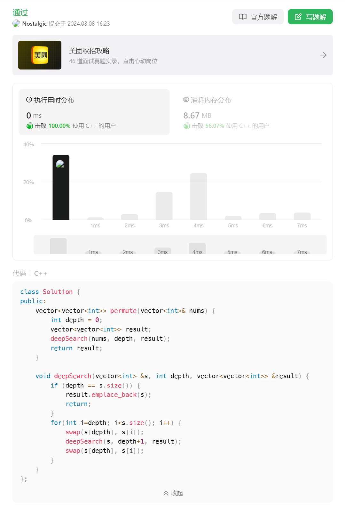

# 46. 全排列⭐⭐


## 分析
* 因为都是不重复的数字，所以不用考虑重复问题
* 可以利用深度优先搜索，遍历每一种组合
* 主要问题是深搜递归进入下一层如何避免重复遍历上一层的元素
* 这里可以通过一个等长的$visited$数组来解决重复遍历问题

## 题解：$Visited$
```{admonition} $Visited$魔法
* 利用$visited$数组避免重复搜索
* searchPath用于保存搜索中间状态
* 注意本层搜索完成后需要恢复状态
```

```cpp
vector<vector<int>> permute(vector<int>& nums) {
    // 保存结果
    vector<vector<int>> result;
    // 保存访问状态
    vector<bool> visited(nums.size(), false);
    // 保存访问路径
    vector<int> searchPath;
    // 深度优先搜索所有组合
    deepSearch(result, nums, searchPath, visited);
    return result;
}

// 深度优先搜索
void deepSearch(vector<vector<int>>& result, vector<int>& nums,
                vector<int>& searchPath, vector<bool>& visited) {
    // 访问路径长度和数组nums一致表示已经访问到叶子节点，可以回溯了
    if (nums.size() == searchPath.size()) {
        // 保存本次搜索路径
        result.emplace_back(searchPath);
        return;
    }

    for (int i = 0; i < nums.size(); i++) {
        // 跳过已访问过的索引
        if (visited[i]) {
            continue;
        }

        // 标记已访问索引
        visited[i] = true;
        // 将已访问的节点添加到当前搜索路径
        searchPath.push_back(nums[i]);
        
        // 递归搜索下一层
        deepSearch(result, nums, searchPath, visited);

        // 递归退出后恢复状态
        visited[i] = false;
        searchPath.pop_back();
    }
}
```

## 题解：$Swap$
```{admonition} $Swap$魔法
* 全排列本质是将不同的元素往不同的索引位置放一遍
* 单独把元素抠出来放到临时空间不如直接原地交换
* 确定第$0$个元素的时候，将其它的元素都交换到$0$号位
* 确定第$1$个元素的时候，再将剩下的除了$0$号的元素都交换到$1$号位
* 确定第$2$个元素的时候，再将剩下的除了$0$号和$1$号的元素交换到$2$号位
* 一直到确认完最后一个元素，将最终的路径加入结果集
* 不好理解，$but\ it\ works!!!$
```

```cpp
vector<vector<int>> permute(vector<int>& nums) {
    // 搜索深度
    int depth = 0;
    // 保存结果
    vector<vector<int>> result;
    // 深度优先搜索所有组合
    deepSearch(nums, depth, result);
    return result;
}

void deepSearch(vector<int> &s, int depth, vector<vector<int>> &result) {
    // 搜索完成，回溯结果
    if (depth == s.size()) {
        result.emplace_back(s);
        return;
    }

    // 注意：从当前深度开始往下递归，而不是从0开始
    for(int i=depth; i<s.size(); i++) {
        // 确认depth位的元素
        swap(s[depth], s[i]);
        // 递归访问下一个元素
        deepSearch(s, depth+1, result);
        // 递归回溯后恢复状态，方便下一轮将其它元素填到这个位置
        swap(s[depth], s[i]);
    }
}
```

## 题尾
两种算法都很棒，我更喜欢$Visited$魔法，可读性满分，但是$Swap$魔法执行速度真是快到令人发指！


## 参考
[1] 46. 全排列 https://leetcode.cn/problems/permutations/description/

