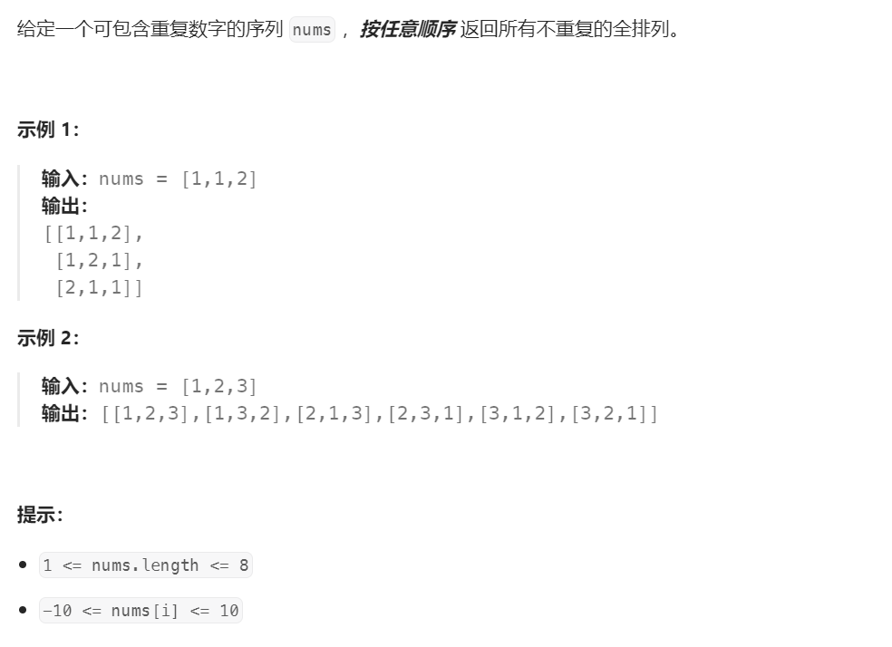
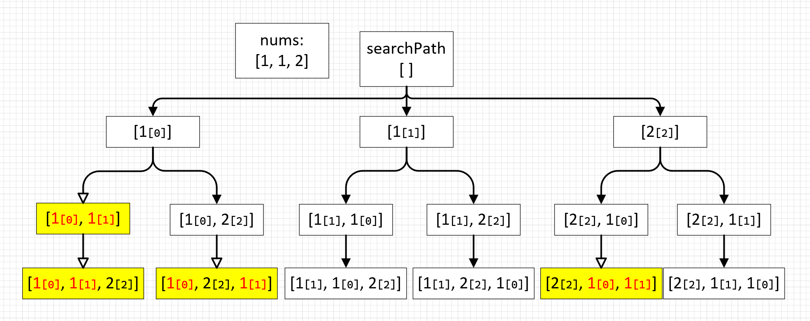
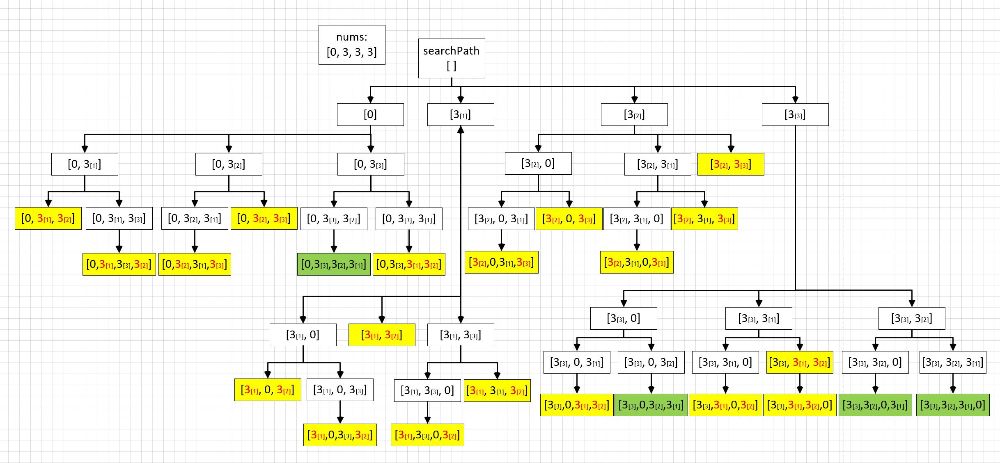

# 47. 全排列 II⭐⭐



## 分析
* 有重复序列的全排列也是全排列，先解决全排列问题这个问题就解了一半
* 序列中包含重复数字，会导致结果中产生很多重复组合
* 消除重复有两种方法，一种暴力从全排列结果中遍历去重（就不推荐了，但是能解决问题）
* 一种是求解过程中就跳过重复项的魔法

## 重复组合消除的魔法
```{admonition} 重复组合消除的魔法
直接上结论：
* 将原始数列排序，以保证相同的数字都在一起
* 在本轮遍历过程中，如果这个数字按索引正序连续出现过2次（不是3次或更多），就跳过
```

```cpp
if (visited[i] ||
    (i > 0 && visited[i - 1] && nums[i] == nums[i - 1])) {
    continue;
}
```

* 这个结论我想了很久都没相通，脑子这个好东西我实在是不够用，画个图来辅助理解：
1. 这个魔法生效的前提是要有序，所以需要对nums数列进行排序
2. 根据图示，相同数字连续出现两次时会被排除掉，按索引正序出现（红黄标记）
3. 相同数字按索引逆序同时出现则被保留
4. 任意两个相同数字之间的相对位置关系只有两种，要么是索引正序，要么是索引逆序，这里刚好排除了一半



* 换一种写法也可以，这次刚好过滤掉相同数字逆序组合（没办法承认我看漏了官方题解的感叹号😓）
```
if (visited[i] ||
    (i > 0 && !visited[i - 1] && nums[i] == nums[i - 1])) {
    continue;
}
```

* 这魔法太神奇，我又验证了一下数列$[3,3,0,3]$


## 题解
* `searchPath`表示当前搜索路径，`visited`表示当前节点是否已添加到路径
* 先按照无重复全排列思路做一遍
* 然后加上过滤条件即可
```cpp
vector<vector<int>> permute(vector<int>& nums) {
    // 保存结果
    vector<vector<int>> result;
    // 保存访问状态
    vector<bool> visited(nums.size(), false);
    // 保存访问路径
    vector<int> searchPath;
    // 深度优先搜索所有组合
    deepSearch(result, nums, searchPath, visited);
    return result;
}

// 深度优先搜索
void deepSearch(vector<vector<int>>& result, vector<int>& nums,
                vector<int>& searchPath, vector<bool>& visited) {
    // 访问路径长度和数组nums一致表示已经访问到叶子节点，可以回溯了
    if (nums.size() == searchPath.size()) {
        // 保存本次搜索路径
        result.emplace_back(searchPath);
        return;
    }

    for (int i = 0; i < nums.size(); i++) {
        // 跳过已访问过的索引
        if (visited[i] ||
            // 跳过相同数字索引正序连续出现的组合
            (i > 0 && visited[i - 1] && nums[i] == nums[i - 1])) {
            continue;
        }

        // 标记已访问索引
        visited[i] = true;
        // 将已访问的节点添加到当前搜索路径
        searchPath.push_back(nums[i]);

        // 递归搜索下一层
        deepSearch(result, nums, searchPath, visited);

        // 递归退出后恢复状态
        visited[i] = false;
        searchPath.pop_back();
    }
}
```

## 参考
[1] 47. 全排列 II https://leetcode.cn/problems/permutations-ii/description/

