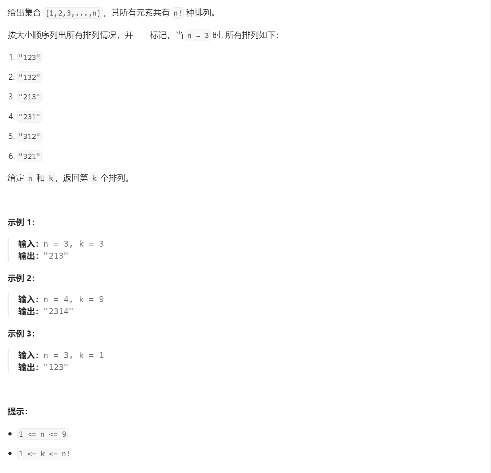

# 60. 排列序列⭐⭐⭐


## 分析
* 最基本的解法就是按照全排列做一遍，然后数到第k个排列的时候返回
* 或者利用**康托展开**<sup>[2]</sup>公式来计算第k个排列

## 题解：全排列
```cpp
void deepSearch(int n, int k, vector<bool>& visited, string& path,
                vector<string>& result) {
    if (result.size() == k) {
        return;
    }

    if (path.size() == n) {
        result.emplace_back(path);
        return;
    }

    for (int i = 1; i <= n; ++i) {
        if (visited[i]) {
            continue;
        }
        path.push_back(i + '0');
        visited[i] = true;
        deepSearch(n, k, visited, path, result);
        path.pop_back();
        visited[i] = false;
    }
}

string getPermutation(int n, int k) {
    vector<bool> visited(n + 1, false);
    vector<string> result;
    string path;
    deepSearch(n, k, visited, path, result);
    return result.back();
}
```

## 题解：康托展开
```{admonition} 康托展开魔法
* 康托展开是一个全排列到一个自然数的双射，常用于构建哈希表时的空间压缩。 康托展开的实质是计算当前排列在所有由小到大全排列中的顺序，因此是可逆的。
```


## 参考
[1] 60. 排列序列 https://leetcode.cn/problems/permutation-sequence/

[2] 康托展开 https://zh.wikipedia.org/wiki/%E5%BA%B7%E6%89%98%E5%B1%95%E5%BC%80