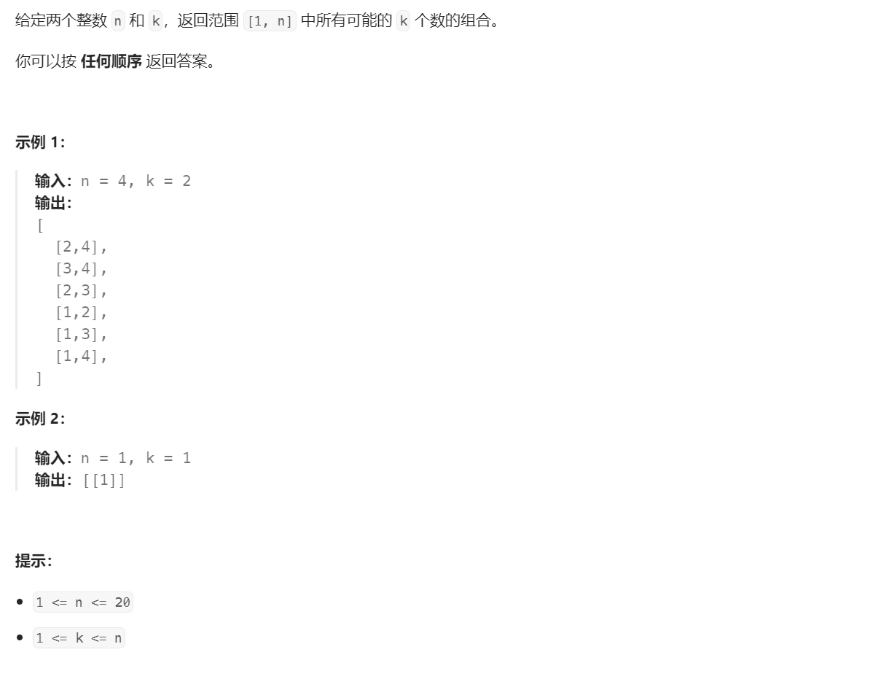

# 77. 组合


## 分析
* 注意这里组合是不考虑排列顺序的
* 另外一层意思，这里相当于是对不重复序列取两两组合

## 题解

```cpp
vector<vector<int>> combine(int n, int k) {
    vector<int> path;
    vector<vector<int>> result;
    deepSearch(n, 1, k, path, result);
    return result;
}

void deepSearch(int n, int start, int k, vector<int>& path,
                vector<vector<int>>& result) {
    if (path.size() == k) {
        result.emplace_back(path);
        return;
    }

    for (int i = start; i <= n; ++i) {
        path.emplace_back(i);
        deepSearch(n, i + 1, k, path, result);
        path.pop_back();
    }
}
```

## 题解：TODO

## 参考
[1] 77. 组合 https://leetcode.cn/problems/combinations/