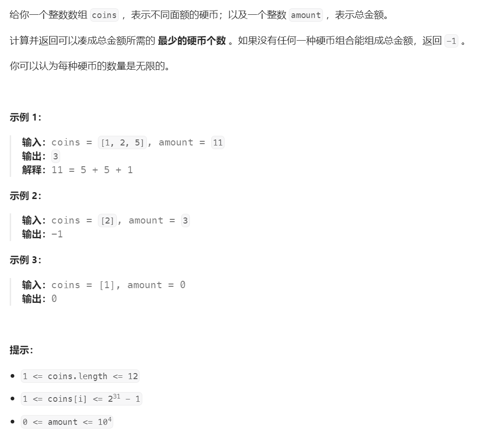

# 322. 零钱兑换⭐⭐



## 分析
```{admonition} 零钱兑换的魔法
* 这里需要用到动态规划思路
* 将目标金额$amount$作为目标状态$dp(amount)$
* 目标金额可以由上一个状态转换而来：$dp(amount - coin_i)$
* 每次迭代取最小的那个金额：$Min(dp(amount-coin_i))$
* 从$0$开始依次迭代到目标金额$amount$
```

### 初始条件分析
* 当目标值$amount$小于$0$时，用任何一枚硬币都没办法兑换，返回$-1$

$$
dp(amount) = -1
$$

$$
amount \in \mathbb{Z-}
$$


* 当目标值$amount$等于$0$时，一枚硬币都不需要，返回$0$

$$
dp(0) = 0
$$

### 动态规划分解
* 目标状态值可以由上一个状态迭代过来，当兑换只需要一枚硬币即可达成时，最终所需硬币数$+1$即为目标值

$$
dp(amount) = dp(amount-coin) + 1
$$

* 考虑到硬币的多样性，最后一枚硬币可能是所有硬币中的任意一枚，这里取期望中的最小值
```{admonition} 魔法
这里有魔法：子问题最优能递推最终问题最优
```


$$
dp(amount) = min(dp(amount-coin_1)+1, dp(amount-coin_2)+1,...dp(amount-coin_n)+1)
$$


## 题解：递归
* 确认好状态迁移方程之后，递归方式比较容易实现，套用公式即可

```cpp
int coinChange(vector<int>& coins, int amount) {
    // 初始条件
    if (amount == 0) {
        return 0;
    }
    if (amount < 0) {
        return -1;
    }

    // 临时变量记录最小值
    int min = INT_MAX;
    for (auto coin : coins) {
        // 递归求解子状态
        int counter = coinChange(coins, amount - coin);
        // 记录最小值
        if (counter >= 0 && counter < min) {
            min = counter;
        }
    }
    if (min != INT_MAX) {
        return min + 1;
    }
    // 没有找到能凑成总金额的硬币组合
    return -1;
}
```

## 题解：迭代
* 递归的缺陷明显，很容易受到栈大小的限制，对于一些特殊的测试用例很容易超时或者栈溢出
* 利用迭代的方式来替换递归只需要规划额外的空间来记录中间状态，用于推导出最终的状态
```cpp
int coinChange(vector<int>& coins, int amount) {
    if (amount < 0) return -1;
    // 状态池，默认-1表示没找到目标值
    vector<int> dp(amount + 1, -1);
    // 初始条件
    dp[0] = 0;
    // 从1开始一步步推导出目标值
    for (int i = 1; i <= amount; i++) {
        int min = INT_MAX;
        for (int coin : coins) {
            // 查找本轮目标值中的最小值
            if (i - coin >= 0 && dp[i - coin] >= 0 && dp[i - coin] < min) {
                min = dp[i - coin];
            }
        }
        // 确认本轮目标值
        dp[i] = (min == INT_MAX) ? -1 : min + 1;
    }
    return dp[amount];
}
```

## 最值问题
```{admonition} 魔法：贪心算法
每层的取值都是从上一层最优值（最小）迭代而来，每一步取最优解而实现最终结果的最优解。实际上肯定也存在部分局部不是最优解但是最终是最优解的分支，这里都给裁剪忽略了罢了，贪心算法并不适用于所有问题。

前面的题解也都只是魔法的应用，要验证魔法是否成立，建议全量搜索遍历所有可能解，虽然不是最优解，但至少可以验证魔法
```


## 参考
[1] 322. 零钱兑换 https://leetcode.cn/problems/coin-change/description/

[2] 贪心算法 https://en.wikipedia.org/wiki/Greedy_algorithm