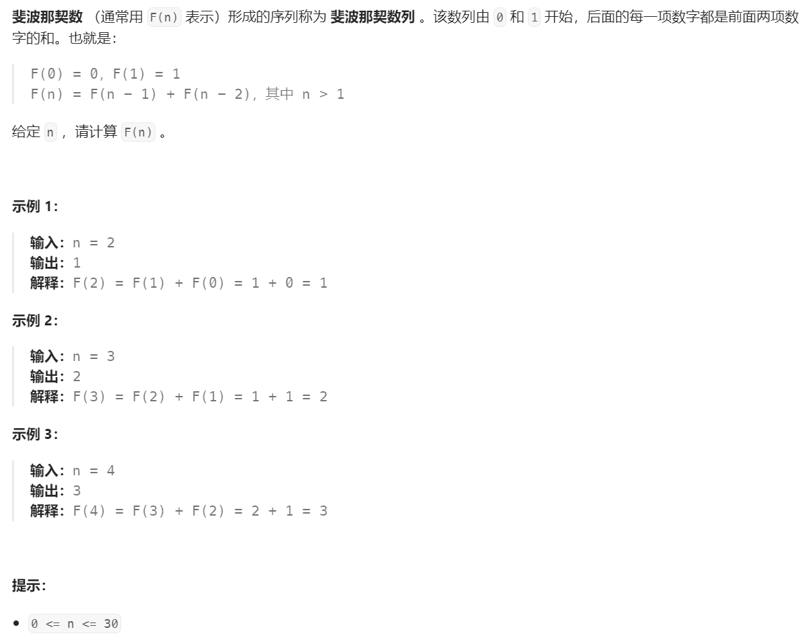

# 509. 斐波那契数⭐



## 分析

### 1. 动态规划分解
* 其实题目已经给出了详细的迭代公式，按照公式应用即可

$$
F(n) = F(n-1) + F(n-2)
$$

$$
n \in \mathbb{N}
$$

### 2. 初始条件迭代
$$
F(0) = 0
$$

$$
F(1) = 1
$$

$$
F(2) = F(1) + F(0)
$$

## 题解：递归
* 套用公式
```cpp
int fib(int n) {
    if (n == 0) {
        return 0;
    } else if (n == 1) {
        return 1;
    } else {
        return fib(n - 1) + fib(n - 2);
    }
}
```

## 题解：迭代
* 利用两个中间变量记住前两个状态，然后从低到高迭代计算期望值
```cpp
int fib(int n) {
    int f1 = 0;
    int f2 = 0;
    int f = 0;
    for (int i = 0; i <= n; i++) {
        if (i == 0) {
            f = 0;
        } else if (i == 1) {
            f = 1;
        } else {
            f = f2 + f1;
        }
        f1 = f2;
        f2 = f;
    }
    return f;
}
```

## 参考
[1] 509. 斐波那契数 https://leetcode.cn/problems/fibonacci-number