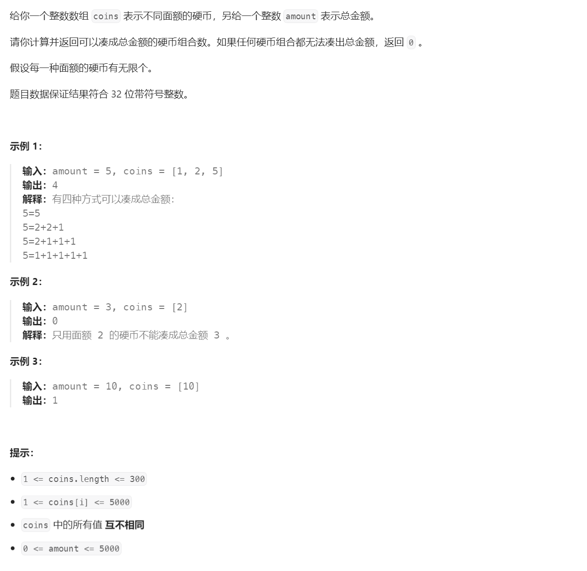
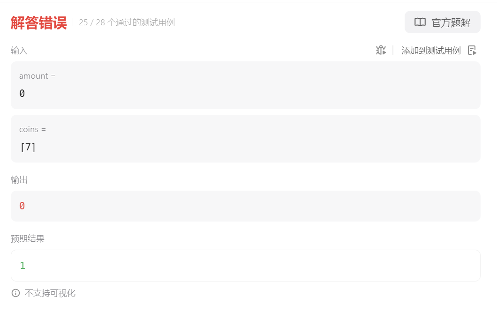

# 518. 零钱兑换 II⭐⭐


## 分析
* 这道题和**零钱兑换**<sup>[2]</sup>最大的不同是，前者要计算兑换所需的最小数量组合，这里要统计所有组合
* 这道题和**爬楼梯**<sup>[3]</sup>很像，都是要计算组合数，但是爬楼梯可以排列，而这道题不可以
* 关于排列：爬楼梯先走一步，再走两步和先走两步再走一步属于两种组合，这里只能算一种

### 动态规划分解
* 定义状态方程$dp(i_{coin}, j_{amount})$表示要凑成目标金额$j_{amount}$，并且用从$0$到$coin_i$能达到的组合数，$n=coins.size()$，目标是计算$dp(n_{coin}, amount)$
* 其中

$$
coin_i \in \{0,coin_0,coin_1, coin_2,\cdots,coin_{n-1}\} \mid 0\le i \le n
$$

$$
j_{amount} \in \{0,1,2,\cdots, amount\}
$$

### 状态转移
* 当使用$coin_i$时，为了凑齐目标金额$j_{amount}$，可能会依次使用0枚、1枚、2枚、3枚$\cdots$

$$
dp(i, j_{amount}) = dp(i-1, j_{amount}-0\times coin_i) + \\
dp(i-1, j_{amount}-1\times coin_i) + \\
dp(i-1, j_{amount}-2\times coin_i) + \\
\cdots + \\
dp(i-1, j_{amount}-k\times coin_i) + \\
$$

$$
其中：j_{amount} \ge k\times coin_i
$$

* 总结就是：

$$
dp(i, j_{amount}) = \sum_{k=0}^{j_{amount} \div coin_i} dp(i-1, j_{amount} - k \times coin_i )
$$

### 初始条件分析

```{admonition} 用例：$amount = 5$，$coins = [1,2,5]$
* $n = coins.size() \Rightarrow n= 3$
* $ 0 \le i \le n \Rightarrow i \in \{0, 1, 2, 3\}$
* $coin_i \in \{0, 1, 2, 5\}$
* $0 \le j_{amount} \le 5 \Rightarrow j_{amount} \in \{0, 1, 2, 3, 4, 5\}$
```

1. 当$i=0, j>0$时，表示没有硬币可用于兑换成目标金额，所以组合数为0，即：

$$
dp(0, j_{amount}) = 0
$$

2. 当$i=1, j=1$时，只有一种兑换组合：

$$
dp(1, 1) = 1
$$

3. 根据前面的状态转移方程有：

$$
 \\
dp(1, 1) = dp(0, 1 - 0 \times 1) + dp(0, 1 - 1 \times 1)
$$

4. 即：

$$
dp(1,1)=dp(0, 1) + dp(0, 0) =1
$$

5. 由前面可以推导出：

$$
dp(0, 0) = 1
$$

6. 所以，当$j=0$时，$dp(i, 0) = 1$，其实际意义是，当目标金额为0时，使用**不用任何金币的组合**即可达成目标金额，空集合也是一个集合

$$
dp(i, 0) = 1
$$

```{admonition} 目标金额为0时对应组合数的官方定义
* 虽然题目中并没有给出目标金额为0时的示例，但是全部测试用例中有定义，答错了才能看到
```


## 题解
* 要记录所有的状态需要大小为$(coins.size() + 1) \times (amount+1) $的数组$dp$
* 默认数组全部初始化为$0$，表示没有合适的组合能满足目标金额
* 根据前面的分析$dp[0][0] = 1$
* 金币循环从$1$起，注意金币下标是$i-1$
```cpp
int change(int amount, vector<int>& coins) {
    int n = coins.size();
    vector<vector<int>> dp(n + 1, vector<int>(amount + 1, 0));
    dp[0][0] = 1;
    for (int i = 1; i <= n; ++i) {
        for (int j = 0; j <= amount; ++j) {
            for (int k = 0; k <= j / coins[i - 1]; ++k) {
                dp[i][j] += dp[i - 1][j - k * coins[i - 1]];
            }
        }
    }
    return dp[n][amount];
}
```

## 内外循环问题
```{admonition} 内外循环可以交换
* 有人说，金币循环一定要在金额循环外面
* 但是这里交换内外并不影响最终结果
```
```cpp
int change(int amount, vector<int>& coins) {
    int n = coins.size();
    vector<vector<int>> dp(amount + 1, vector<int>(n + 1, 0));
    dp[0][0] = 1;
    for (int j = 0; j <= amount; ++j) {
        for (int i = 1; i <= n; ++i) {
            for (int k = 0; k <= j / coins[i - 1]; ++k) {
                dp[j][i] += dp[j - k * coins[i - 1]][i - 1];
            }
        }
    }
    return dp[amount][n];
}
```

## 参考
[1] 518. 零钱兑换 II https://leetcode.cn/problems/coin-change-ii

[2] 322. 零钱兑换 https://leetcode.cn/problems/coin-change

[3] 70. 爬楼梯 https://leetcode.cn/problems/climbing-stairs

