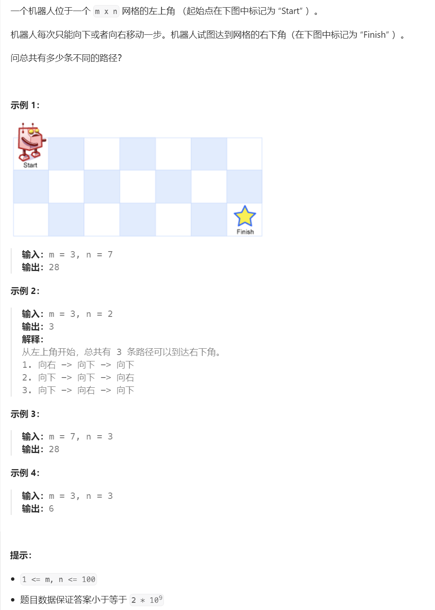

# 62. 不同路径⭐⭐


## 分析
### 1. 动态规划分解
* 要达到位置$(m,n)$，最多有两种方式，一种是先达到$(m-1, n)$，或者$(m, n-1)$；然后将这两种方式加起来即可

$$
dp(m, n) = dp(m-1, n) + dp(m, n-1)
$$


### 2. 确认初始条件
* 当$m=1$或者$n=1$的时候，不管另一个数是多少都只有一条路径，即
$$
dp(m, 1) \equiv 1
$$
$$
dp(1, n) \equiv 1
$$


## 题解，递归
* 递归方式比较符合直觉，容易实现，但是很容易收到栈限制，大概数字超过50之后就执行超时了
```cpp
int uniquePaths(int m, int n) {
    if (m == 1 || n == 1) {
        return 1;
    }
    return uniquePaths(m - 1, n) + uniquePaths(m, n - 1);
}
```

## 题解，迭代
* 由于当前的值是由上一个状态计算来的，可以利用$m \times n$的数组存储递归过程中每一层的状态值，然后从第一层开始，一层一层迭代计算下一层的值，直到计算出预期的值
* 注意前面分析的时候起始位置是从1开始的，程序里面数组下标大多是从0开始的，所以会出现索引下标差异
```cpp
int uniquePaths(int m, int n) {
    vector<vector<int>> dp(m, vector<int>(n));
    for (int im = 0; im < m; im++) {
        for (int in = 0; in < n; in++) {
            if (im == 0 || in == 0) {
                dp[im][in] = 1;
            } else {
                dp[im][in] = dp[im - 1][in] + dp[im][in - 1];
            }
        }
    }
    return dp[m - 1][n - 1];
}
```


## 参考
[1] 62. 不同路径 https://leetcode.cn/problems/unique-paths/