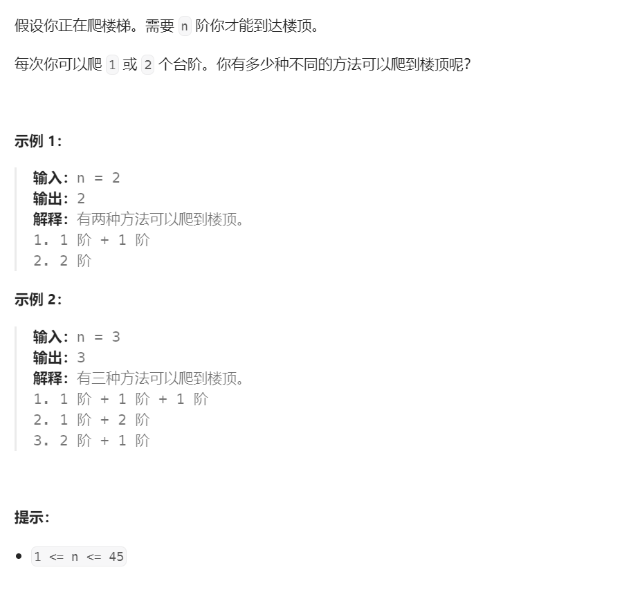

# 70. 爬楼梯⭐



## 分析

### 1. 动态规划分解
* 爬到第$n$个台阶有两种方式，一种是从第$n-1$往上爬一阶，一种是从第$n-2$往上爬两阶
* 如果能分别算出爬到$n-1$和$n-2$层各有几种方式，把它们加起来，就可以得到爬到$n$阶有多少种方式（这一点其实不太容易理解，建议从起始条件多迭代几次求证）

$$
dp(n) = dp(n-1) + dp(n-2)
$$

### 2. 初始条件迭代

$$
dp(1) = 1
$$

$$
dp(2) = 2
$$


$$
dp(3) = dp(2) + dp(1)
$$


## 题解：递归
* 递归方式基本是直接套用公式就可以实现了，缺点明显，$n$过大时（大概超过45）很容易超时
```cpp
int climbStairs(int n) {
    if (n == 1) {
        return 1;
    } else if (n == 2) {
        return 2;
    } else {
        return climbStairs(n - 1) + climbStairs(n - 2);
    }
}
```

## 题解：迭代
* 递归写法换成迭代写法，需要中间变量记住最近的两次状态
```cpp
int climbStairs(int n) {
    int dp1 = 0;
    int dp2 = 0;
    int dp = 0;
    for (int i = 1; i <= n; i++) {
        if (i == 1) {
            dp = 1;
        } else if (i == 2) {
            dp = 2;
        } else {
            dp = dp1 + dp2;
        }
        dp1 = dp2;
        dp2 = dp;
    }
    return dp;
}
```

## 参考
[1] 70. 爬楼梯 https://leetcode.cn/problems/climbing-stairs